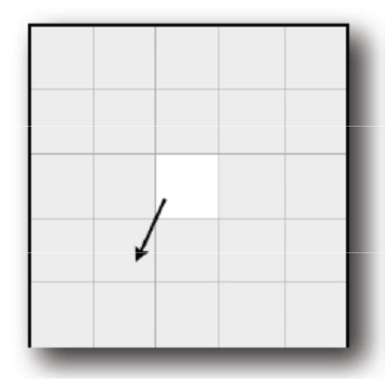
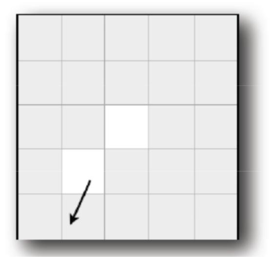
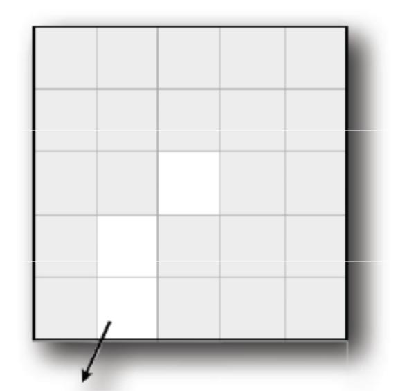
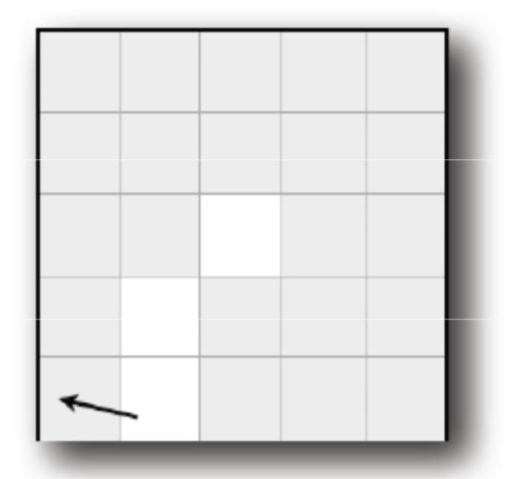
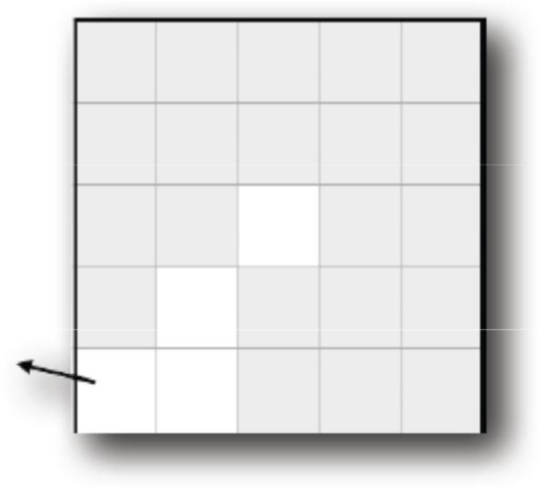

> ALGORITMOS Y ESTRUCTURAS DE DATOS

**Guía 3. Clases y Objetos, Primeros Pasos**

Dada:

Class myPoint

{

 public:

 (…)

 private: double x; double y;

};

1.  Se pide implementar una función miembro de la clase myPoint double
    getDistanceBetweenPoints(Point p) que calcule la distancia
    euclidiana entre sí misma y el punto recibido como parámetro.

2.  Se pide implementar una función miembro de la clase myPoint double
    getAngleBetweenPoints(Point p) que calcule el ángulo del segmento
    entre sí misma y el punto recibido como parámetro. Tomaremos como
    referencia el cero en el “norte”, y ángulos α crecientes en el
    sentido de las agujas del reloj, 0 ≤ α &lt; 360.

3.  Se pide implementar una función miembro de la clase myPoint void translatePoint(double distance, double angle) que traslade el punto     por una distancia igual a distance y a un ángulo igual a angle. El ángulo está definido igual que en el ejercicio 5.

4.  Se pide implementar una función miembro de la clase myPoint bool
    isPointEqual(Point p) que determine si el punto es coincidente a p.
    Cuando se usan números de coma flotante no se puede simplemente
    verificar la igualdad con el operador igual, sino que se debe
    verificar que la distancia sea menor que cierto valor, por ejemplo
    con ε = 0.0000001. ¿Por qué? ¿Se podrá reciclar alguna función
    anterior?

5.  Se pide definir una clase myRect para rectángulos paralelos a los
    ejes de un sistema de coordenadas cartesiano. El rectángulo debe
    estar representado por los puntos inferior izquierdo y superior
    derecho, usando la clase Point definida antes.

6.  Se pide implementar una función miembro de myRect
    double getRectArea(void) que calcule el área del rectángulo.

7.  Se pide implementar una función miembro de myRect bool
    isPointInRect(Point p, Rect r) que determina si el punto p está
    dentro de o en el borde del rectángulo r.

**Para entregar:**

9. Se pide simular un robot limpia-pisos. Veamos un ejemplo para
 explicar qué es lo que vamos a hacer (en el ejemplo el piso es de 25
 baldosas, 5 x 5 unidades):

a. Tiempo *t* = 0. El robot se encuentra en la posición (2.1, 2.2),
mirando a 205 grados (en el sentido de las agujas del reloj, desde el
“norte”). El robot limpia la baldosa en la que está.

b. Tiempo *t* = 1. El robot se mueve una unidad, en la dirección que
estaba mirando, a la posición (1.7, 1.3), y limpia otra baldosa.

c. Tiempo *t* = 2. El robot se mueve otra unidad en la misma dirección,
a la posición (1.2, 0.4), y limpia otra baldosa.

d. Tiempo *t* = 3. El robot no puede moverse en la misma dirección
porque choca con la pared. Por eso cambia su dirección al azar. En este
ejemplo, a 287 grados.

e. Tiempo *t* = 4. El robot se mueve una unidad en la nueva dirección
hasta (0.3, 0.7), limpiando otra baldosa.

Los detalles de la simulación son:

-   La habitación es rectangular, de largo *h* y ancho *w*. El tamaño de
    la habitación es pasado por línea de comandos y es tal que h &lt;=
    100 y w &lt;=70.

-   El piso está dividido en baldosas de una unidad por una unidad. Las
    baldosas pueden estar limpias o sucias. Inicialmente todo el piso
    está sucio.

-   Hay *n* robots limpiando en simultáneo. La cantidad de robots se
    pasa por línea de comando.

-   Para simplificar las cosas asumiremos que los robots son puntos y se
    pueden cruzar sin interferirse.

-   La posición de un robot se describe con dos números reales, (x, y),
    y su dirección con un ángulo real *d* (0 ≤ *d* &lt; 360). La
    baldosa en que se encuentra es (floor(x), floor(y)).

-   Inicialmente los robots se encuentran dentro de la habitación, en
    posiciones y direcciones al azar.

-   La simulación avanza de a una unidad de tiempo (“*tick”*). En cada
    unidad de tiempo un robot avanza una unidad de distancia desde
    donde se encuentra, en la dirección en la que está.

-   Cuando un robot choca contra una pared conserva su posición
    anterior, y selecciona una nueva dirección al azar.

-   Cuando un robot pisa una baldosa, se considera que limpió
    esa baldosa.

-   El programa termina cuando todas las baldosas quedaron limpias.

-   Se pide desarrollar un programa que implemente los siguientes modos
    de simulación:

    1.  Modo 1: El programa mostrará en tiempo real como se va limpiando
        el piso; graficando las baldosas limpias y sucias, a los
        robots y sus direcciones.

    2.  Modo 2. El programa realizará un gráfico de tiempo medio de
        demora en la limpieza del piso en función de cantidad de
        robots para el tamaño de piso dado. De esta forma comenzará
        con N = 1 y continuará iterando hasta que el tiempo medio para
        N y N+1 sea menor a 0.1. Por cada step en N (cada incremento
        en N) el tiempo medio se calcula promediando
        1000 simulaciones.

Notas:

-   El programa recibe por línea de comandos, el tamaño del piso (Width
    y Heigh), la cantidad de robots (Robots) y el modo de la
    simulación (Modo).

-   En Modo 2 se ignora el parámetro Robots (en el caso de recibirlo).

-   El programa en el Modo 1 informa la cantidad de ticks necesarios
    para limpiar el piso según los parámetros recibidos. En el Modo 2
    muestra el gráfico según se describe arriba.

-   Recuerden separar ideas separadas en módulos separados. Reducir
    dependencias, para el código quede poco ligado, sea fácil de
    entender y se pueda reciclar. Y “as simple as possible”.

